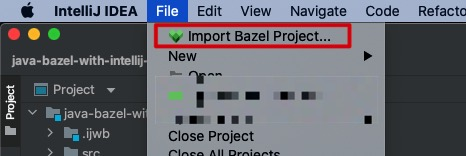
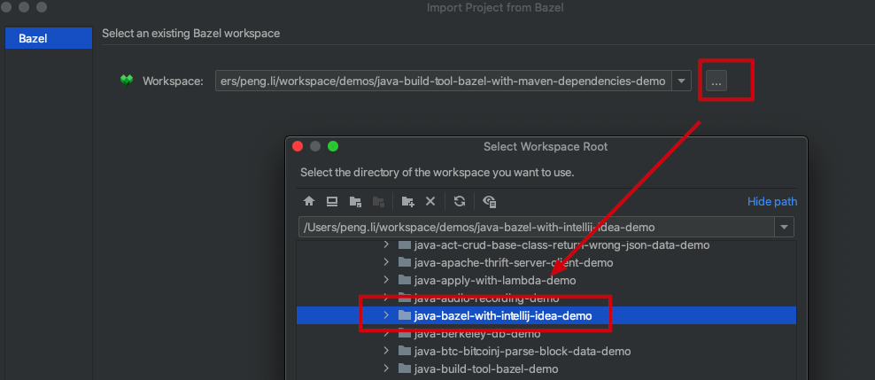
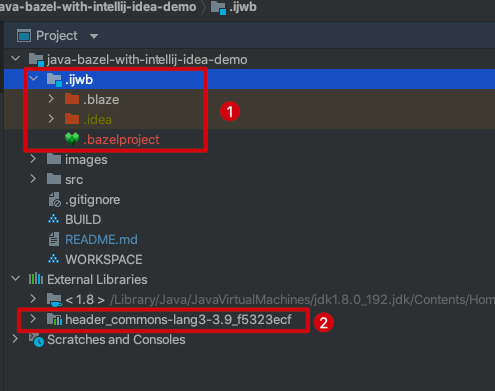
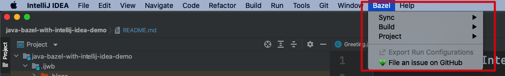

Java Bazel with IntelliJ IDEA Demo
===========================

如何在IntelliJ IDEA中使用zabel项目：

1. IDEA中常规方法安装`zabel`插件
2. 必须使用`File` -> `Import Zabel Project`的方式导入一个zabel项目，才能让zabel插件产生作用，否则它不识别
   
3. 选择正确的workspace路径
   
4. 之后一路next，直到完成
5. 可以看到生成了一个`.ijwb`的目录，包含了项目相关的信息；同时maven dependencies也正确配置
   
6. 同时IDEA的菜单中会多一项`Bazel`，里面包含各种相关命令
   

此时每当我们修改了`WORKSPACE`或`BUILD`文件，就会弹出一个提醒，让我们手动点击`Bazel`菜单中的`Sync`选项，以更新配置。

可以基本正常使用了，虽然比Maven等麻烦不少。

```
brew install bazel
```

```
bazel build :hello
./bazel-bin/hello
```

将会打印出`HELLO`

